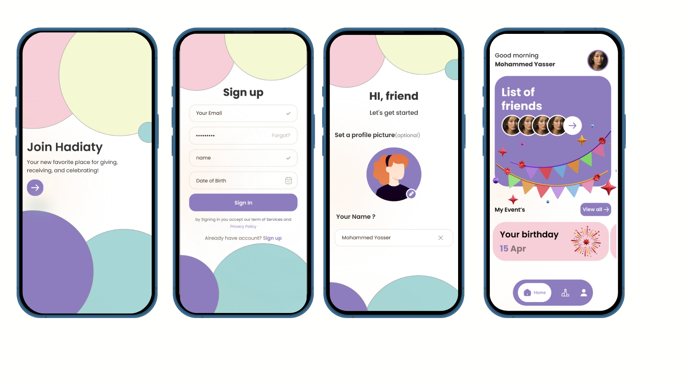
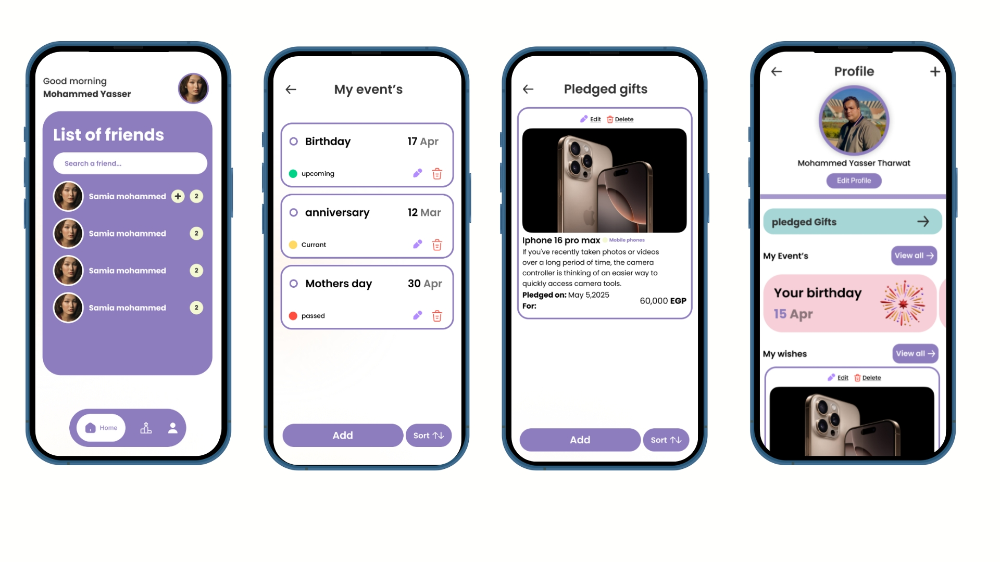

🎁 Hadiaty – Smart Gift & Event Management App

Hadiaty is a modern Flutter application designed to simplify event planning and gift coordination.
It allows users to create events, share wish lists, and let friends and family pledge gifts — eliminating duplicate purchases and improving communication.

What This App Solves

When organizing birthdays, weddings, or special occasions, people often:

Receive duplicate gifts

Don’t know what the person really wants

Have no clear way to coordinate

Hadiaty fixes this by creating a social, real-time gift planning system.

Key Features

Event Creation & Management
Users can create and manage multiple personal events.

Wish Lists per Event
Each event can have its own list of desired gifts.

Gift Pledging System
Friends and family can reserve (pledge) specific gifts so no two people buy the same item.

Real-Time Sync with Firebase
All updates are instantly reflected for all users using Firestore.

Clean & Modern UI
Designed for fast navigation and a smooth user experience.

Business Value

Hadiaty turns event planning into a collaborative and organized experience.
It reduces confusion, prevents duplicate gifts, and makes celebrations more meaningful.

This type of system can be used for:

Gift registries

Wedding planning

Birthday and holiday coordination

Family and group events

🛠 Tech Stack

Flutter

Dart

Firebase Authentication

Cloud Firestore

Real-time Database Architecture

Clean UI Design

What This Project Demonstrates

This app showcases my ability to build:

Real-time apps with Firebase

Multi-user systems

Clean and scalable Flutter architecture

UI/UX optimized for real users

Business-ready mobile solutions

## 📸 Screenshots

Explore the Hadiaty app with these screenshots:

